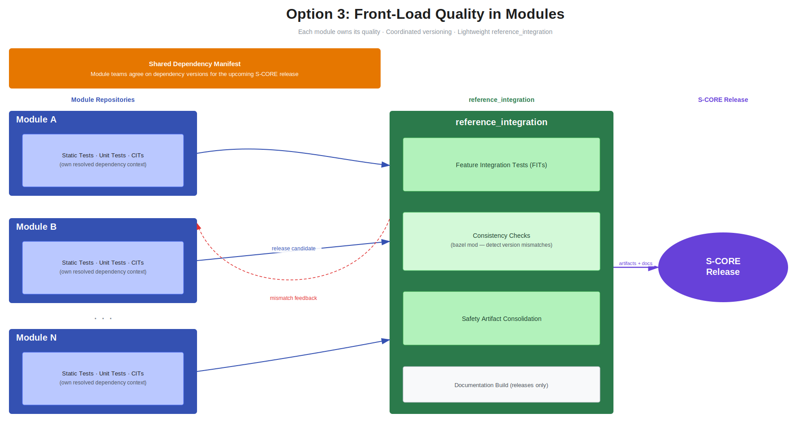

..
   Copyright (c) 2026 Contributors to the Eclipse Foundation

   See the NOTICE file(s) distributed with this work for additional
   information regarding copyright ownership.

   This program and the accompanying materials are made available under the
   terms of the Apache License Version 2.0 which is available at
   https://www.apache.org/licenses/LICENSE-2.0

   SPDX-License-Identifier: Apache-2.0

DR-008-Int: S-CORE integration scope in reference_integration repository
========================================================================

- **Date:** 2026-03-31

.. dec_rec:: Integration scope in reference_integration repository
   :id: dec_rec__int__scope_reference_integration
   :status: accepted
   :context: Integration
   :decision: Option 3

Context / Problem
-----------------

Currently there is no clear definition of scope and responsibilities of the ``reference_integration`` repository.
The process of integration of S-CORE modules is time consuming and leaves open space for misalignment
between the process and the feature teams.

Goals and Requirements
^^^^^^^^^^^^^^^^^^^^^^

- **Effort**: The integration process should be as efficient as possible with clear feedback loops.
- **Independence**: Modules should be independent with their implementation scope.
- **Integration**: Modules should have clear common requirements for S-CORE release integration.
- **Clear Ownership**: Each module should have a clear vision of responsibilities for integrating into reference_integration.
- **Maintainability**: Keep long-term maintenance effort low.

Non-Goals
~~~~~~~~~

- Controlling every release of each Module - Modules can release independently and some releases can be not integrated into S-CORE.

Options Considered
------------------

Option 1: Execute only Feature Integration Tests in reference_integration repository
^^^^^^^^^^^^^^^^^^^^^^^^^^^^^^^^^^^^^^^^^^^^^^^^^^^^^^^^^^^^^^^^^^^^^^^^^^^^^^^^^^^^

Reference_integration repository is a place where only Feature Integration Tests are executed.
Every Module is responsible for executing static tests, UTs, CITs in their respective repositories,
used configurations, compiling flags and workflows should be aligned with S-CORE guidelines.

Reference_integration will provide a means to conduct continuous integration, based on only Feature Integration Tests,
of latest Modules states to ensure early feedback and breaking changes notifications.

For S-CORE releases, Modules need to deliver artifacts from local tests as their release assets to be used for certification and documentation.

Pros:

* Modules have full control over their own scope
* Quick integration jobs in reference_integration repository as only Feature Integration tests are executed

Cons:

* No control over configuration, compiling flags, variants
* Documentation and artifacts are distributed across different repositories
* Full-stack S-CORE release might resolve to different version of dependencies that were tested in Module repositories which makes the release not compliant with S-CORE release requirements.

Option 2: Re-execute all quality checks in the reference_integration repository
^^^^^^^^^^^^^^^^^^^^^^^^^^^^^^^^^^^^^^^^^^^^^^^^^^^^^^^^^^^^^^^^^^^^^^^^^^^^^^^

Reference_integration repository is a place where all kinds of tests - static, UTs, CITs, FITs are re-executed
for full verification of the S-CORE full-stack. Every Module needs to ensure their tests are executable in reference_integration
repository. For the verification process, common configuration, compiling flags are used across all Modules to ensure the compliance with current S-CORE guidelines.

Reference_integration will provide a means to conduct continuous integration of latest Modules states to ensure early feedback and breaking changes notifications.

All necessary artifacts and single documentation build are generated in reference_integration repository to be used for certification and documentation
of S-CORE releases.

Pros:

* Single point of truth for configurations, compiling flags, documentation and certification artifacts
* Better control over resolved dependencies
* Better traceability of the tests and documentation for full-stack S-CORE releases

Cons:

* Additional effort for the Module teams to maintain their tests and dependencies to be fully executable in reference_integration repository
* Longer integration jobs in reference_integration repository as all tests are executed

Option 3: Front-load quality checks in modules with lightweight reference_integration
^^^^^^^^^^^^^^^^^^^^^^^^^^^^^^^^^^^^^^^^^^^^^^^^^^^^^^^^^^^^^^^^^^^^^^^^^^^^^^^^^^^^^

Modules follow the S-CORE process and run quality tooling in their own context against their own resolved
dependency set. Across modules, teams agree on *what* quality tooling and toolchains to use, but each
module runs them independently. Most importantly, teams agree on dependency versions for the upcoming
S-CORE release: if a module is releasing a new version into the next S-CORE release, every module that
depends on it must migrate to that version before the release. Modules minimize non-dev, non-S-CORE
dependencies in their MODULE.bazel files.

Module Owners deliver as part of their release artifacts in the common form allowing aggregation and
full documentation build in reference_integration. Bazel dependency analysis will allow verification
that collected artifacts are valid for S-CORE release - resolved dependencies for the Module (in scope of their repository)
must match the dependencies for S-CORE release and resolved in reference_integration.

Continous integration of latest Modules based on hashes from their main branches will not allow verification
of the artifacts and full documentation build. That will remain exclusive for S-CORE releases.

Pros:

* Verifying quality where it originates is more reliable — modules have full knowledge of their domain, their specific quality requirements, and the exact dependency context they were tested against
* Technically simpler reference_integration with a well-defined, minimal scope
* Avoids re-executing all checks in a different dependency context, which can mask or introduce issues
* Provides early feedback through regular release candidate publishing

Cons:

* Requires tighter communication and coordination across module teams
* Agreeing on and enforcing a shared dependency manifest adds process overhead
* Backward compatibility guarantees need to be actively maintained across all modules

Comparison
----------

.. list-table:: Reference_integration options comparison
   :header-rows: 1
   :widths: 30 20 20 30

   * - Criterion
     - Option 1
     - Option 2
     - Option 3
   * - Quality checks location
     - Module repositories only
     - reference_integration (re-executed)
     - Module repositories (front-loaded)
   * - Feature integration tests
     - reference_integration
     - reference_integration
     - reference_integration
   * - Dependency mismatch risk
     - High
     - Low
     - Low (via version agreements)
   * - Integration job duration
     - Short
     - Long
     - Short
   * - Artifact & documentation consolidation
     - Distributed across repositories
     - Single point of truth
     - Consolidated at release time
   * - Module team maintenance effort
     - Low
     - High
     - Medium
   * - Cross-module coordination overhead
     - Low
     - Medium (triage of CI failures)
     - Medium (shared dependency manifest)
   * - Traceability for S-CORE release
     - Weak
     - Strong
     - Strong (via release artifacts)

Evaluation
----------

Option 1 makes S-CORE provide a set of SEooCs without being a full-stack project that has been selected
in :need:`dec_rec__strat__consistent_stack_vs_reference`.
Modules are responsible for their own compliance with the S-CORE release requirements, which makes it difficult
to validate the final S-CORE release for the process compliance.
The biggest risk is that Module A can deliver a release and artifacts with dependency on Module B in version x.y.z,
but in reference_integration thus overall S-CORE release, Module B will be resolved in version x.y.z+1,
which makes Module A artifacts not compliant.

Option 2 truly makes S-CORE a full-stack project and provides a single point of truth for the
configurations, compiling flags, variants, documentation and certification artifacts.
However, it requires additional effort for the module teams to maintain their tests and dependencies to be fully
executable in the reference_integration repository with both public APIs and tests.
It allows generating a single documentation build with full traceability across different repositories which will stay persistent
and will not require external linking.

Option 3 front-loads quality verification into the modules themselves and keeps reference_integration
lightweight. It addresses the dependency mismatch risk of Option 1 through coordinated version
agreements across modules rather than by re-executing checks centrally. However, it relies on
disciplined inter-module coordination and backward compatibility guarantees, which adds process
overhead and requires a shared dependency manifest to remain manageable.

.. _option3_infographic:

   Option 3 visual breakdown

**Decision:** Option 3 got positive feedback and was selected by the community.
We accept a trade-off of full documentation beeing available only for S-CORE releases,
while having a more efficient and reliable integration process without extra efforts to maintain
internal test targets in reference_integration repository.
